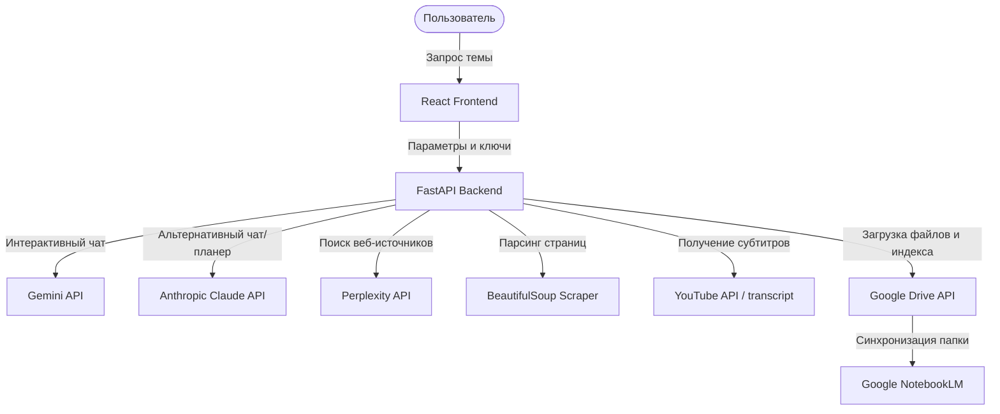

# 🧠 NotebookLM-Linker (NotebookLM Drive Sync)

[](https://opensource.org/licenses/MIT)
[](https://www.python.org/)
[](https://www.docker.com/)

**NotebookLM-Linker** — это интеллектуальный инструмент для автоматического сбора, структурирования и синхронизации исследовательских материалов напрямую с вашим Google Диском, подготовленный специально для использования в качестве источника (Source) для **Google NotebookLM**.

Превратите хаотичный поиск информации в структурированную базу знаний для вашего "второго мозга" в один клик!

---

## 🚀 Основные возможности

*   🔍 **AI-Планирование исследований:** Обсуждение и уточнение темы с ИИ-ассистентом на этапе подготовки (глубина, свежесть, авторитетность источников).
*   🌐 **Мульти-источниковый поиск:** Автоматический поиск актуальной технической информации, официальной документации и статей через API **Perplexity AI** (модель `sonar`).
*   📺 **Интеграция с YouTube:** Поиск релевантных видеоматериалов и автоматическое извлечение их текстовых расшифровок (transcripts) для анализа.
*   📄 **Умный веб-скрейпинг:** Очистка веб-страниц от шума (навигации, рекламы, футеров) и конвертация контента в чистый Markdown.
*   📂 **Структурированный экспорт в Google Drive:** Автоматическое создание папок, загрузка материалов в удобных форматах и генерация интерактивного индекса ссылок `SOURCES_INDEX.md`.
*   🔑 **Гибкое управление ключами:** Поддержка как серверных API-ключей, так и динамического ввода личных ключей Gemini, Anthropic Claude и Perplexity прямо из веб-интерфейса (с сохранением в `localStorage`).
*   🐳 **Docker-ready:** Полная контейнеризация бэкенда (FastAPI) и фронтенда (React/Vite) с поддержкой Nginx проксирования.

---

## 🛠️ Архитектура системы



---

## 📋 Требования к окружению

Для работы проекта вам понадобятся:
*   Python 3.10 или новее (для ручного запуска)
*   Node.js 18+ и npm (для фронтенда)
*   Docker и Docker Compose (для запуска в контейнерах)
*   Google Cloud проект с включенным **Google Drive API** и OAuth 2.0 Client ID credentials.

---

## ⚙️ Настройка и Установка

### 1. Подготовка Google Drive API

Чтобы приложение могло загружать файлы на ваш Google Диск:
1. Перейдите в [Google Cloud Console](https://console.cloud.google.com/).
2. Создайте проект и включите **Google Drive API**.
3. Настройте экран согласия OAuth (OAuth consent screen) в тестовом режиме, добавив свой email в список тестовых пользователей.
4. Перейдите в раздел **Credentials**, нажмите **Create Credentials** -> **OAuth client ID**. Выберите тип приложения **Desktop app**.
5. Скачайте JSON-файл учетных данных и сохраните его в корне проекта под именем `credentials.json` (или переименуйте скачанный файл).

---

### 2. Настройка переменных окружения

Создайте файл `.env` в корневом каталоге проекта на основе примера:
```bash
cp .env.example .env
```
Заполните параметры в `.env`:
```env
GEMINI_API_KEY=ваш_ключ_gemini (опционально, если вводите в UI)
ANTHROPIC_API_KEY=ваш_ключ_claude (опционально, если вводите в UI)
PERPLEXITY_API_KEY=ваш_ключ_perplexity (опционально, если вводите в UI)
PORT=8000
HOST=0.0.0.0
```

---

### 3. Быстрый старт через Docker (Рекомендуется)

Запуск всех сервисов в фоновом режиме:
```bash
docker-compose up -d --build
```
После успешного запуска:
*   Веб-интерфейс будет доступен по адресу: `http://localhost:8082`
*   API бэкенда: `http://localhost:8000`

> [!NOTE]
> При первом запуске синхронизации бэкенд выведет в логи ссылку авторизации Google Drive. Откройте логи бэкенда (`docker logs notebook_lm_backend`), перейдите по ссылке, авторизуйтесь и скопируйте код авторизации (или подтвердите вход). Сгенерированный файл `token.json` будет сохранен в корне для последующих запусков.

---

### 4. Ручная установка (без Docker)

#### Бэкенд (Python)
1. Перейдите в директорию бэкенда и создайте виртуальное окружение:
   ```bash
   python -m venv .venv
   source .venv/bin/activate  # На Windows: .venv\Scripts\activate
   ```
2. Установите зависимости:
   ```bash
   pip install -r requirements.txt
   ```
3. Запустите сервер:
   ```bash
   python main.py serve
   ```

#### Фронтенд (React / Vite)
1. Перейдите в директорию `frontend`:
   ```bash
   cd frontend
   ```
2. Установите зависимости и запустите dev-сервер:
   ```bash
   npm install
   npm run dev
   ```
3. Веб-интерфейс откроется по адресу `http://localhost:5173`.

---

## 📖 Как пользоваться приложением

1. **Авторизация:** При первом запуске убедитесь, что приложение подключено к вашему Google Диску (кнопка статуса в левой панели).
2. **Ввод темы:** Напишите тему, которую хотите исследовать (например: *«Использование Playwright для автоматизации тестирования на Python»*).
3. **Обсуждение (Refining):** AI-ассистент предложит направления. Вы можете скорректировать требования в чате.
4. **Генерация плана (Search Plan):** Нажмите кнопку «Сгенерировать план». Сервер предложит список конкретных статей, гайдов и видео с YouTube.
5. **Выбор источников:** Выберите галочками только те источники, которые вам действительно нужны.
6. **Синхронизация:** Нажмите «Запустить синхронизацию». Приложение скачает контент, переведет его в Markdown и загрузит на ваш Google Диск.
7. **Подключение к NotebookLM:** 
    *   Зайдите в [Google NotebookLM](https://notebooklm.google.com/).
    *   Создайте новый блокнот.
    *   Добавьте в качестве источника Google Диск папку `NotebookLM_Sources/{Название_темы}`.
    *   Готово! Теперь у вас есть собственный экспертный AI-помощник по выбранной теме.

---

## 🔒 Безопасность и хранение ключей

*   Проект разработан с учетом требований безопасности. Все персональные ключи (Gemini/Claude/Perplexity API), которые вы вводите во вкладке **Settings** (Настройки), сохраняются исключительно в вашем браузере (`localStorage`) и отправляются в заголовках запросов без сохранения на сервере.
*   Файлы `credentials.json`, `token.json` и локальный `.env` добавлены в `.gitignore` и не попадут в ваш публичный репозиторий.

---

## 🤖 Версии ИИ-моделей (Важное примечание для разработчиков)

*   **Google Gemini**: Используется модель `gemini-flash-latest` (алиас для `gemini-1.5-flash`), что обеспечивает лимит в 1500 запросов в день на бесплатном тарифе (Free Tier).
*   **Anthropic Claude**: В качестве основной модели настроена **`claude-sonnet-4-6`** (прописана в `backend/config.py`).
    > [!IMPORTANT]
    > Не используйте устаревшие или неподдерживаемые на аккаунте версии (например, `claude-3-5-sonnet-20241022`), так как API Anthropic возвращает для них ошибку `404 Not Found` (model not found).

---

## 📄 Лицензия

Этот проект распространяется под лицензией **MIT**. Подробности в файле [LICENSE](LICENSE).

---
*Создано с ❤️ для автоматизации исследований и создания баз знаний.*
